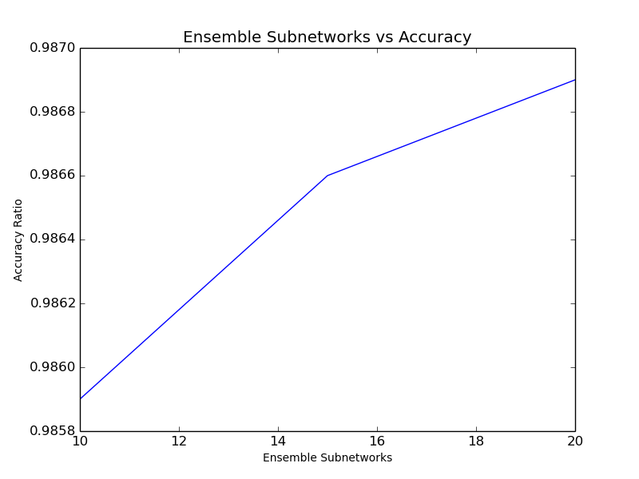

{{ page.title }}
----------------
For a recent assignment in the Machine Learning and Big Data course of my Master's program,
I was asked to add bagging, or [bootstrap aggregating](https://en.wikipedia.org/wiki/Bootstrap_aggregating), to a digit recognition neural network.
We were provided an [example digit recognition network written in Python with Keras and Theano](https://github.com/zatonovo/deep_learning_ex/blob/master/digit_recognition/ex_mnist.py),
and asked to enhance it to improve on the the default 0.984 accuracy.

I created a Juypter notebook on [the deep learning docker image](https://github.com/saiprashanths/dl-docker) 
we are using for the course, and began tweaking the existing network to see what improvements I could achieve.
I eventually arrived at a model I liked which was still largely similar to the 
initial example network with some adjustments to dropout and the application of max normalization to weights.

Using my "preferred" network, an ensemble of 10 networks were trained over 40 epochs with mini-batches
of 256.   To create the ensemble, a dictionary of Keras models was created (`v8_1_model` 
function creates my "preferred" network ... it was my 8th experiemental network).


def createBaggingModels(n):
    """Helper function to create a dictionary of submodels for use in the bagging training"""
    bagModels = {}
    for i in range(subModelCount):
        name = "8_1" + string.ascii_lowercase[i]
        print name
        bagModels[name] = (ex_mnist.v8_1_model())
        
    return bagModels


The `createBaggingModels` helper function created our 10 network ensemble. 
Note that it is limited to 26 submodels due to the use of the `ascii_lowercase` array for naming.
This was sufficient for my use, but should probably be converted to integer for extensibility.


subModelCount = 10
models = createBaggingModels(subModelCount)


The ensemble was then run through the training logic. Each models' weights are saved to the file system for re-use. The 
[Numpy `random.choice`](https://docs.scipy.org/doc/numpy/reference/generated/numpy.random.choice.html) 
function helps us sample with replacements for the training set specific to the iteration's model.


# Train all the models
toTrain = models.keys() 
bootstrapTrainSize = len(X_train) * 1
for k in toTrain: 
    print("Training model: " + k)
    trainNdx = np.random.choice(range(len(X_train)), int(bootstrapTrainSize))
    m, h = ex_mnist.run_network([X_train[trainNdx], X_test, y_train[trainNdx], y_test], models[k], epochs=40)
    models[k].save_weights("model-" + k + ".hdf5", overwrite=True)


Initially, only the averaging technique for aggregation was applied, but voting was added so 
a comparison could be done. The code for the `BaggingAverage` and `BaggingVote` aggregation functions
are shown below. They each follow a similar structure. 
[Numpy's argmax function](https://docs.scipy.org/doc/numpy/reference/generated/numpy.argmax.html)
provides a convenient method of extracting the predicted label but depends on the
result structure being an Numpy `ndarray` of size 10 (0-9), where the index into the array cooresponds 
to the digit label. Print statements
are still visible from my debugging phases, but these could be removed or converted
to "verbose" output.


def BaggingAverage(results, verbose = False):
    """Average the probabilities for a given test sample across models to finalize the prediction""" 
    correct = 0.0
    missedTests = []
    predictionMisses = []
    for i in range(samples):
        #print(y_test[i])
        gs = np.argmax(y_test[i])
        ra = np.zeros(10)
        for r in results:
            ra += r[i]
            #print(r[i])
        f = ra / len(results)
        prd = np.argmax(f)
        frnd = np.round(f, 5)

        if(prd == gs):
            correct += 1
        else:
            if(verbose):
                for r in results:
                    print(np.round(r[i], 5))
                print("Agg: " + str(frnd))
                print("Predicted: " + str(prd))
                print("GoldStd:   " + str(gs))
            missedTests.append(X_test[i])
            predictionMisses.append(prd)
   
    return correct



def BaggingVote(results, verbose = False):
    """Vote based on the probabilities for a given test sample across models to finalize the prediction"""
    correct = 0.0
    
    missedTests = []
    predictionMisses = []
    for i in range(samples):
        #print(y_test[i])
        gs = np.argmax(y_test[i])
        votes = np.zeros(10)
        for r in results:
            # Use argmax to get the primary vote from this model and increment the cooresponding slot 
            # in the aggregated result
            vote = np.argmax(r[i])
            #print(vote)
            votes[vote] += 1

        # Use argmax again to extract the slot that has the most votes.
        prd = np.argmax(votes)

        if(prd == gs):
            correct += 1
        else:
            if(verbose):
                for r in results:
                    print(np.round(r[i], 5))
                print("Votes: " + str(votes))
                print("Predicted: " + str(prd))
                print("GoldStd:   " + str(gs))
            missedTests.append(X_test[i])
            predictionMisses.append(prd)
    
    return correct


The `results` list passed into both functions was populated similar to the following code segment. [Keras'
predict_proba function](https://keras.io/models/sequential/), which returns the raw network probabilities, 
is used to preserve the pre-classified results for use later in the aggregating functions.
The `for` loop provides each submodel in the ensemble an opportunity to generate it's output (the ensemble model
is loaded into the `remodel` dictionary with each submodel being an entry in the dictionary).


samples = 10000
results = []
print("Running predictions on " + str(samples) + " test set samples...")
for k in remodels.keys():
    print("Model: " + k)
    p = remodels[k].predict_proba(X_test[:samples], verbose=0)
    results.append(p)


Finally, the helper functions are called to determine the overall performance of the ensemble model:


# What is our percentage success from averaging?
print ("Bagging w/ Averaging")
print ("--------------------")
correct = BaggingAverage(results)
print ("Misses: " + str(samples - correct))
print correct/samples

# Separator...
print
print

# What is our percentage success from voting?
print ("Bagging w/ Voting")
print ("-----------------")
correctVote = BaggingVote(results)
print ("Misses: " + str(samples - correctVote))
print correctVote/samples


The above code segment produces output as shown below with 10 submodels in the ensemble:

```
Bagging w/ Averaging
--------------------
Misses: 141.0
0.9859


Bagging w/ Voting
-----------------
Misses: 143.0
0.9857
```

Somewhat as expected, when additional submodels were included in the ensemble,
the accuracy improved. At 15 submodels, everything else equal, the following results
were observed (out of 10,000 test samples). Although maybe not statistically significant, 
the averaging technique seems to do slightly better than voting for this classification use case. 

```
Bagging w/ Averaging
--------------------
Misses: 134.0
0.9866


Bagging w/ Voting
-----------------
Misses: 136.0
0.9864
```

A 20 submodel ensemble was tested as well, and the results of the 3-way test are shown below. In this limited investigation,
additional submodels quickly began to show diminishing marginal returns.



* Note: The ex_mnist.py originated from 
[ZataNovo's GitHub Repo](https://github.com/zatonovo/deep_learning_ex/blob/master/digit_recognition/ex_mnist.py),
which in turn derived it from [Vict0rSch's GitHub](https://github.com/Vict0rSch/deep_learning/blob/master/keras/feedforward/feedforward_keras_mnist.py)
and [Wxs's GitHub](https://github.com/wxs/keras-mnist-tutorial/blob/master/MNIST%20in%20Keras.ipynb) examples.

* [Bootstrap aggregating](https://en.wikipedia.org/wiki/Bootstrap_aggregating)


Best,

[Daniel (@dwdii)](http://twitter.com/dwdii)
